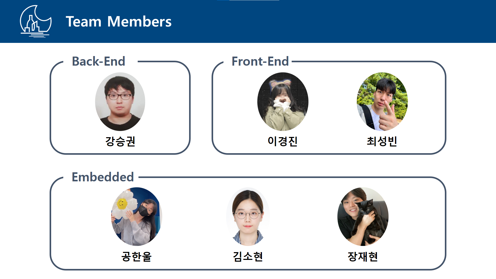
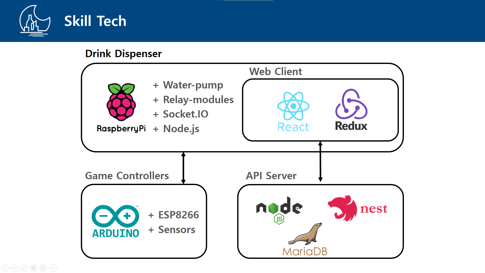
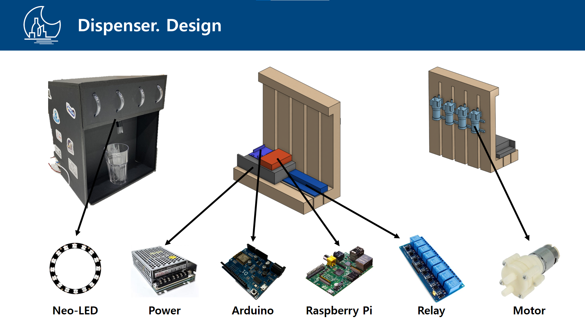
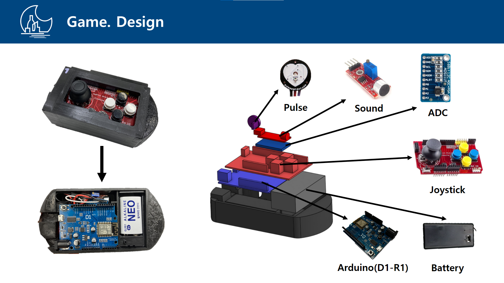
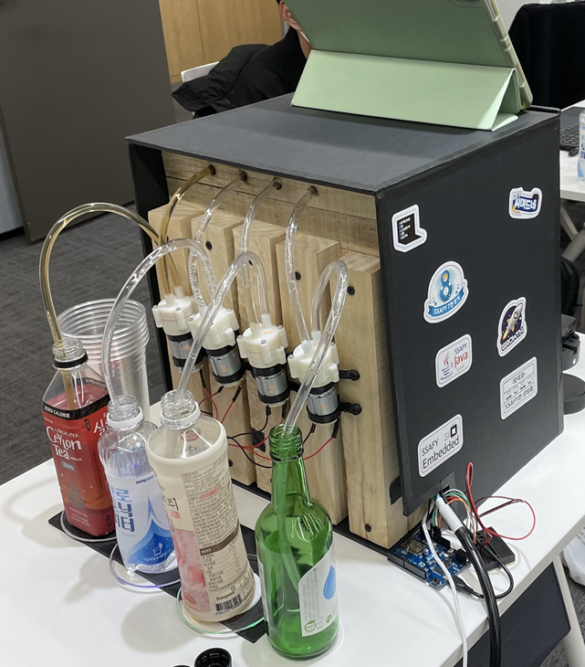
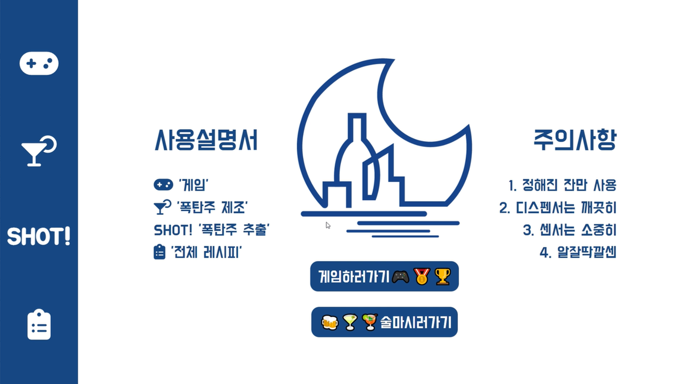

🍻술친구

## 프로젝트 개요

- 팀명 : 복분자 (Black Berry)
- 서비스명 : 술친구 (Your Drink Buddy)
- 개발기간 : 2023.01.03 ~ 2023.02.17

## 기획 의도

최근 음식점들은 각 테이블마다 태블릿이 하나씩 배치되어 주문할 수 있는 테이블 오더가 가능해지고 있습니다.
호프점도 마찬가지로 태블릿을 통해 매장의 주류와 안주류를 주문할 수 있고, 여기에 게임을 할 수 있게 하여 술자리를 갖는 사람들에게 즐겅무을 제공하고 있습니다.
이에 저희도 술자리에서 더 많은 즐거움을 줄 수 있는 방안을 고안해본 결과,
한정된 술이 아닌 다양한 칵테일을 제공하고 게임 컨트롤러를 사용해 멀티 플레이어 게임이 가능한 프로젝트인
술자리를 위한! 술자리에 의한! 술게임 및 술 제조 플랫폼 술친구 입니다!

## 서비스 소개

술 디스펜서와 다양한 센서가 탑재된 컨트롤러로 사람들에게 색다른 술자리 즐거움을 제공합니다.

- 최대 4개의 술을 조합하여 칵테일 제조가 가능합니다.
- 사용자가 원하는 칵테일 레시피를 선택할 수 있는 것에 더해 해당 레시피의 비율을 변경한 칵테일 또한 제조가 가능합니다.
- 최대 4명의 사람들이 각자 하나의 컨트롤러를 가지고 함께 멀티플레이 술게임이 가능합니다.
- 소켓통신을 이용하여 라즈베리파이와 아두이노 간, 그리고 라즈베리파이와 웹 간 1:N 통신을 구현하여 술게임이 가능합니다.
- 조이패드, 소리, 심박수, 압력을 포함하여 다양한 센서를 이용한 술게임이 가능합니다.
- 작은 디스플레이에 맞는 UI로 사용자의 편리함을 추구하였습니다.
- 게임의 특성에 맞게 도트 캐릭터를 담은 화면을 구성하여 게임을 시각적으로도 즐길 수 있도록 하였습니다.

## 개발 멤버 소개

## 개발

 <b> 상세 기술스택 및 버전</b> 

| 구분     | 기술스택        | 상세내용           | 버전      |
| -------- | --------------- | ------------------ | --------- |
| 공통     | 형상관리        | Gitlab              | \-        |
|          | 이슈관리        | Jira                | \-        |
|          | 커뮤니케이션    | Mattermost, Notion | \-        |
| BackEnd  |                 | JPA                |      |
|          | Java            | Zulu               |  |
|          |                 | Spring Boot        | 2.7.11     |
|          | IDE             | IntelliJ           | 2022.3.1  |
|          | Build           | Gradle             |        |
|          | API Docs        | Postman            |           |
| FrontEnd | HTML5           |                    | \-        |
|          | CSS3            |                    | \-        |
|          | JavaScript(ES6) |                    | \-        |
|          | React           | React              | 18.2.0    |
|          | Node.js         | npm                | 18.14.2   |
|          | IDE             | Visual Studio Code | 1.78.2    |
| Server   | 서버            | AWS EC2            | \-        |
|          | 플랫폼          | Ubuntu\AWS Liunx   | 20.04 , AWS Linux2|
|          | CI/CD           | Docker             | 20.10.23  |
|          |                 | Jenkins            | v.2.375.3-lts-jdk11|
|          |                 | nginx              | v.1.23.3|
|DATA      | DB              | MariaDB            | v.10.10.3 |
|Embedded  |                 | C                  | \-        |
|          |                 | JavaScript         | \-        |
|          |                 | Arduino            | \-        |
|          |                 | ESP8266Wifi        | \-        |
|          |                 | Adafruit_NeoPixel  | \-        |
|          |                 | Raspberry Pi       | 7.17.9    |
|          |                 | Socket.io(v.4.5.4) | v.4.5.4   |
|          |                 | Node.js            | v.18.04   |

서비스 아키텍처

## 설계

### DB 설계

- ERD : https://www.erdcloud.com/d/XnCokHFwmZTqH43GL

### 와이어프레임 설계

- Figma : [figma](https://www.notion.so/figma-276a18a41a874b43bf5917fa4ce4ab34?pvs=21)

### Hardware 설계
- 술 디스펜서

- 게임 컨트롤러

- 제작된 술친구 하드웨어 (좌 정면, 우 후면)
 
   

## 기능 상세

메인 화면

### 술 디스펜서 화면

1. 술 선택

### 술게임 화면

1. 게임 선택

2. 버튼 많이 누르기 게임

       
3. 버튼으로 10초 맞추기 게임

4. 바람을 불어 풍선 많이 터뜨리기 게임

5. 심박수를 활용한 진실게임

6. 랜덤 무게값 넘기기 게임

### 서비스 사용 방법

1. 술 디스펜서의 모터 전원과 라즈베리파이 전원, 게임 컨트롤러 전원을 킨다.
2. 라즈베리파이에서 node index.js를 실행하여 서버와 연결한다.
3. 술친구 웹을 킨다.
4. 술게임 및 칵테일 제조 화면을 키고 술자리를 즐긴다🎶

## 수상
- SSAFY 공통 PJT 웹 IoT 부문 우수상 수상

## 문제 및 해결 방안 (공통)
1. 칵테일을 만들기 위해서는 각 음료 별 일정 비율의 용량을 넣어주어야 함
    → 워터 펌프 동작 시 나오는 유량을 확인 후 한 잔의 음료의 양을 고정(=음료가 만들어지는 시간 고정),
    → 전체 시간 중 각 음료 별 설정한 비율의 시간만큼 각 워터 펌프를 동작시켜 칵테일 제조
    
2. 호스가 비워져 있을 때 칵테일을 만들면 음료가 호스에서 나오기까지의 시간을 소모하여 고정한 한 잔의 음료 양을 채우지 못함
    → 디스펜서를 처음 켰을 때 모든 워터 펌프를 1초 간 동작시켜 호스의 끝까지 음료를 채워 놓음.
    
3. 사용자가 음료 제작 중 중단을 하고 싶은 경우
    → 이 부분은 재현오빠가 코드 짜줘서 잘 모르겠는디요;;
    
4. 음료 교체할 때 호스에 이전 음료의 잔해물이 남아있음.
    → 디스펜서 후면에 해당 호스에 연결했던 음료를 제거한 후에 웹의 버튼을 눌러 워터 펌프를 일정 시간(약 1초) 동안 동작시켜 호스에 남아있는 음료를 빼낸다.
    → 새로운 음료를 호스에 연결한 후 웹 버튼을 다시 누르면 2번 과정이 수행되어 호스의 끝까지 음료를 채워 놓음으로써 음료 교체 과정이 끝난다.
    
## Embedded

**통신**
1. Bluetooth vs. **WiFi(선택)**
    → 제한 없는 다중 연결 지원
    → 빠른 데이터 전송 속도
    → 넓은 통신 범위
    → 내장 와이파이 모듈 사용 
    
**회로 및 센서**

1. Wifi 모듈 (ESP8266 및 ESP-01S)과 아두이노 연결 시 아두이노 IDE에서 모듈 연결이 되지 않는 현상이 계속해서 발생
    → 아두이노에 Wifi (ESP8266)가 내장된 WeMos D1 R1 보드 구매 후 Wifi 연결 확인
    
2. 조이패드 모듈과 D1 R1 연결 후 아두이노 업로드 시 업로드가 되지 않는 현상 발생
    → 조이패드의 내부 회로 문제로 고칠 수 없었음…
    → 업로드를 할 때마다 수동으로 조이패드 탈부착 과정 필요
    
3. 3개 이상의 아날로그 센서를 사용해야 하는데 D1 R1의 아날로그 핀 수가 1개로 디지털 핀에 센서를 연결해야 하는 상황 발생
    → ADC를 추가로 구매하여 센서를 디지털 핀에 연결 후 데이터 확인
    
4. 일정 시간 동안 Wifi 통신을 보낼 때 while loop (무한루프) 코드 동작 시 아두이노 보드가 멈추는 현상 발생
    → Watchdog timer로 인한 보드 재가동(리셋)이 이유
    → while loop 코드 내에서 초기에 `wdtDisable()` 코드를 추가하여 Software watchdog을 비활성화 시킨다.
    → while loop가 종료되면 wdtEnable(1000) 코드를 추가하여 wdt를 다시 활성화한다.
    

## Web

**통신**
1. Multi-Thread vs. **Socket(선택)**
    → 통신의 순서 보장 
    스크린에서 백엔드 서버로의 통신, 그리고 라즈베리파이 서버에서 여러 개의 아두이노와의 통신이 순차적으로 이루어져야 했습니다. Thread를 사용하면 동시에 여러 작업이 처리될 수 있어, 통신 순서가 보장되지 않는다는 리스크가 있습니다. 때문에 소켓을 사용하였고, 소켓의 룸과 네임스페이스 사용으로 클라이언트와 서버 간의 연결을 유지하고 순차적으로 데이터를 주고 받아, 유기적으로 통신의 순서를 보장하였습니다.
    

 ****
## Front

술
1. 화면 속 음료와 실제 포트를 일치하는 방법 고민
2. 선택한 음료로 만들수 있는 레시피 뽑는 방법 고민
3. 추천한 레시피를 눌렀을때 선택한 음료에 맞춰서 비율을 변경해야하는데,
4. 추천 레시피의 음료 순서와 선택한 음료의 순서가 달라서 고민,
5. UI 구성할때 UX경험 올리기 위한 디자인 구성

6. 게임 [ 소켓 통신 ]
플레이어 수에 따른 실시간 화면 분할 [ 컨트롤러 연결 확인을 위한 대기방 구현 ]
게임 플레이할때 생동감을 더해주기 위한 입력값에 따른 케릭터 동작 [ 들어오는 값에 따른 이미지 변화 ]

